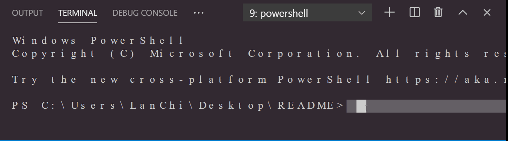

  
  --------------------------------------------------------------
# Title: README generator
----------------------------------------------------------------
###  Description: Generates concise READMEs with basic information about a project.
----------------------------------------------------------------
#Demo: 
-------------------------------------------------------------
#Table of Contents
----------------------------------------------------------------

 *Installation: npm i

 *Usage:Answer a series of prompts about your project and the README generator will create a clean, concise README with your responses.

 *License: None

 *Contributing: Contributions welcome.

 *Test: npm test

#Questions? 
--------------------------------------------------
* 

#Email: null
---------------------------------------------------------
#Made by LanChi Pham, &copy;Copyright 2020
----------------------------------------------------------
  